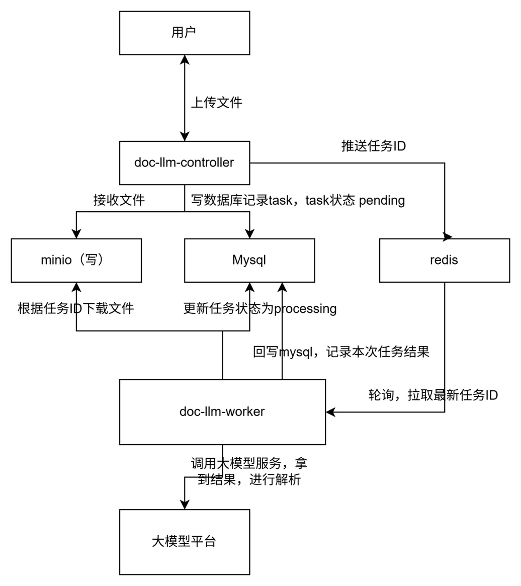
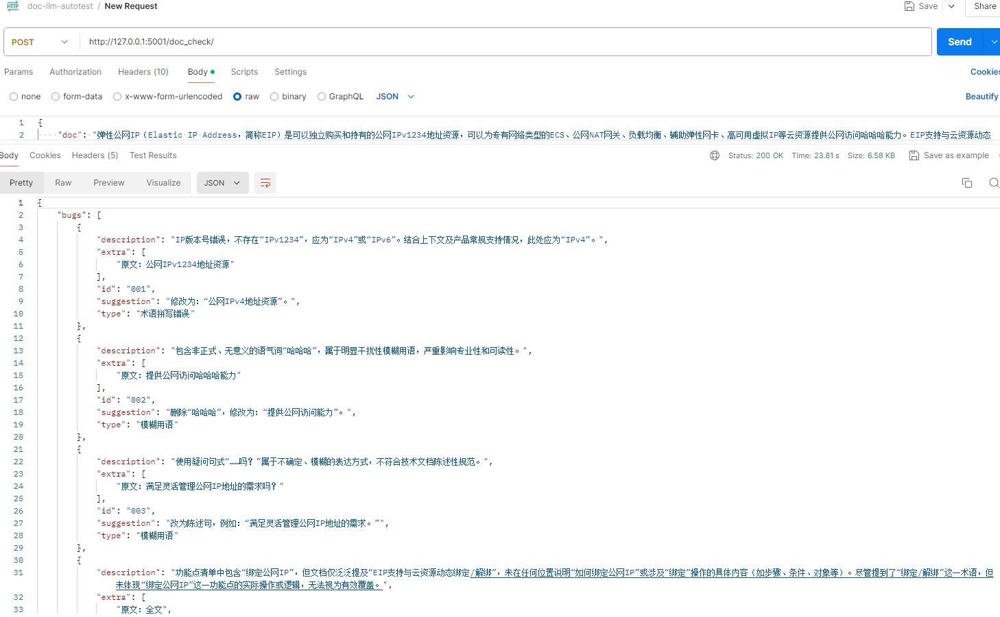

### 项目介绍
1.生成基准prompt
2.设计后端服务，对接线上大模型
3.worker容器轮询redis，从消息队列拿到需要执行的任务
4.大模型响应慢、限流时采用指数退避进行重试，任务异常丢失时采用reaper巡检进行恢复重新入队

### 架构图（Mermaid）

### LLM prompt 配置

### 文档测试流程
初版效果

### API 接口

| service_code | 含义                                  |
| ------------ | ------------------------------------- |
| **2000**     | 操作成功                              |
| **4001**     | 参数不合法（缺少字段、格式错误）      |
| **4004**     | 数据不存在（任务不存在）              |
| **5001**     | 系统内部错误                          |
| **5002**     | 外部依赖失败（比如 Redis/MySQL 错误） |
| **5003**     | LLM 服务不可用                        |

### 启动方式
docker compose up
